# 概述

- 这个仓库展示了`工业缝制花型设计软件SewMake`项目的一些功能，主要包含`远程升级`、`CAD绘图`、`花型设计`、`撤销与重做`等功能的展示，由于该项目`已经商用`，经过询问源码只能开源`部分代码`，同时展示一些`使用功能`，请您见谅🙏。

- 目录说明：
  > `web_server`：远程升级用的web服务器部分源代码。
  > `sew_client`：客户端软件部分源代码。
  > `images`：本README.md相关图片资源文件。

- 下面的动图如果看不清，您可以点击图片<font color=#FF0000 > 放大 </font>查看。

-----

# 主要功能
SewMake的功能主要分为两个主要部分。
- <font color=#FF0000 > 花型浏览：</font>可以实现对已有花型文件的移动、旋转、镜像、图层变换、缝纫点针距设置等功能。同时可以设置批量处理（同时对同一个图层上的所有花型进行统一设置）。
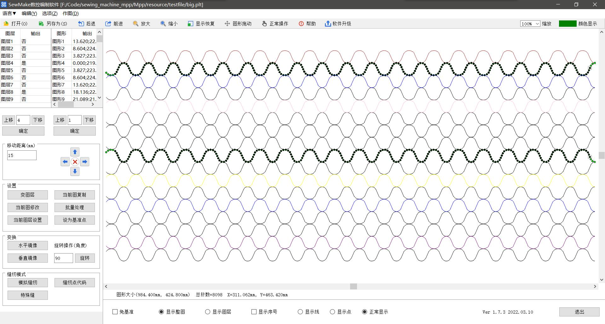

- <font color=#FF0000 > 花型设计：</font>当现有花型不能满足要求的时候，用户可以设计自己需要的花型。SewMake支持可以像CAD绘图一样的花型设计。
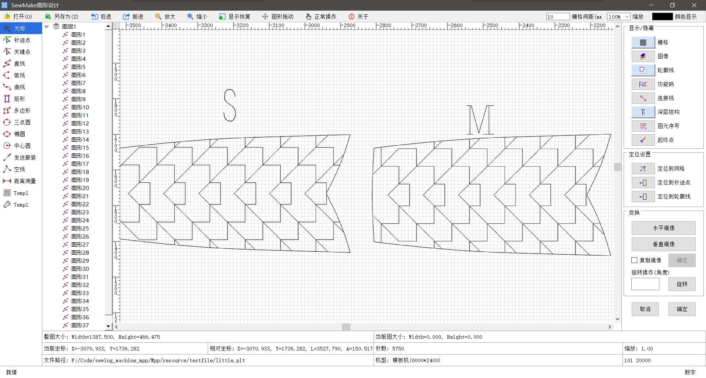

# 重要功能展示
针对上面提到的两大功能模块，下面展示一些SewMake的重要功能。

## CAD绘图功能
SewMake可以像CAD一样设计自己需要的缝纫花型，目前支持的花型包括：`直线`、`弧线`、`曲线`、`矩形`、`多边形`、`三点圆`、`椭圆`、`中心圆`。
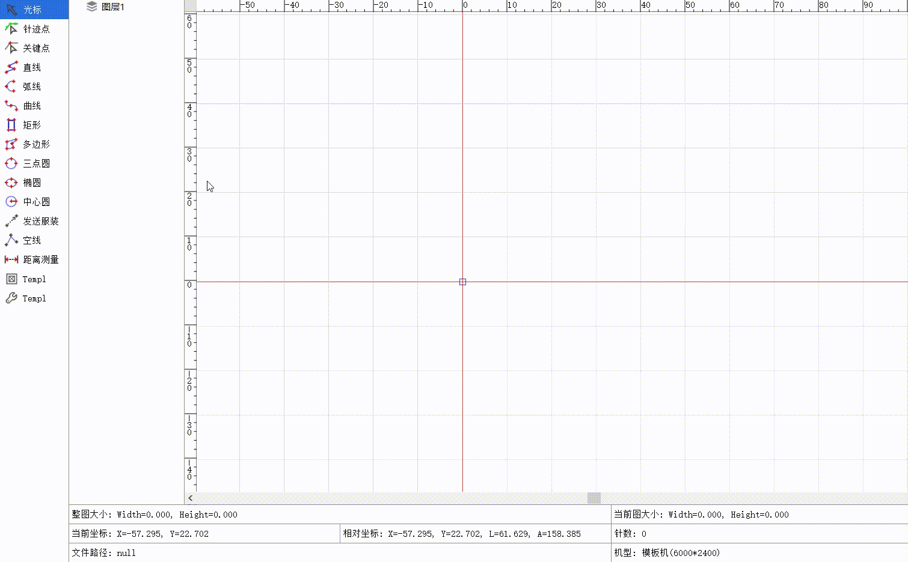

绘图原理是使用了状态机的思想，对每个图形的绘制状态进行枚举，鼠标点击引起状态切换。

## 远程升级
SewMake在启动的时候会自动检查更新，当然也可以手动更新，下面这幅图展示了它的自动更新功能。
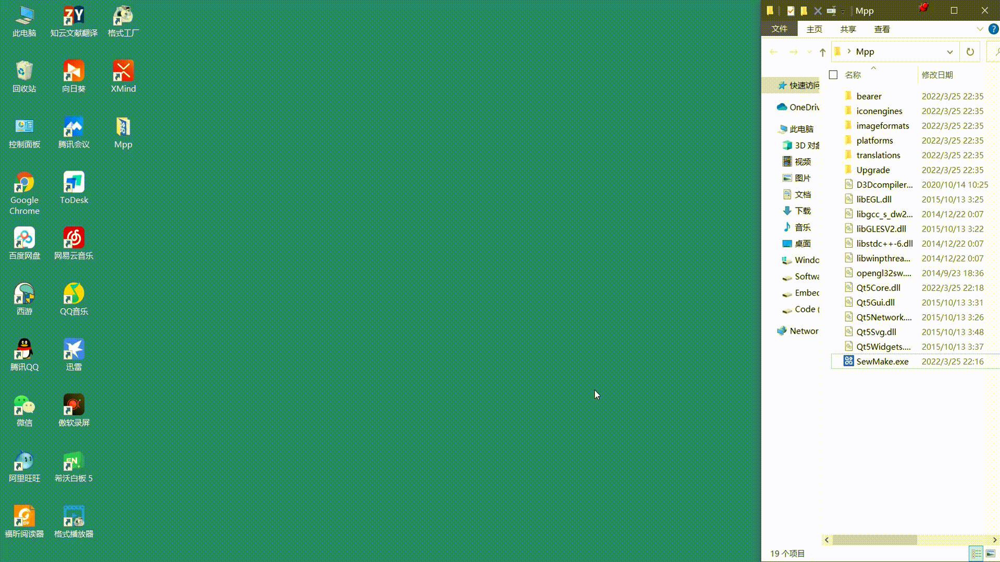
远程升级的时候，SewMake会去web server服务器上获取最新版本的软件，然后经过MD5校验，此后解压软件包，确认无误才会更新本地的旧版本软件。

> 在云服务器上实现了远程升级中要使用的web server服务器。

## 模拟缝纫
设计好缝纫花型后，可以进行模拟缝纫，以观察实际的缝纫效果是否符合预期。
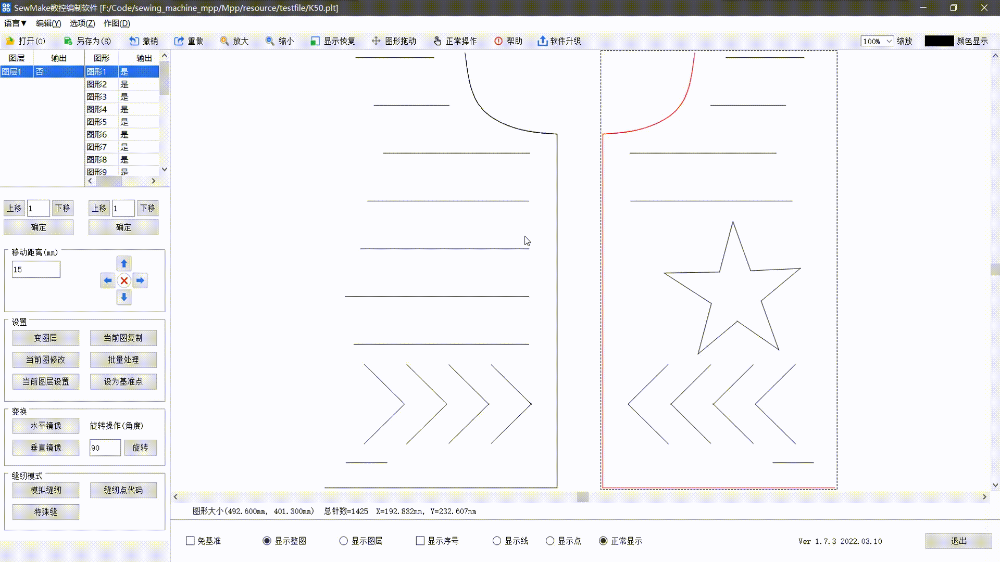

## 花型设计
除了可以打开现有的缝纫花型文件，当当前花型文件不满足要求时，用户可以设计自己需要的花型，因为我们开发了花型设计功能供用户使用。
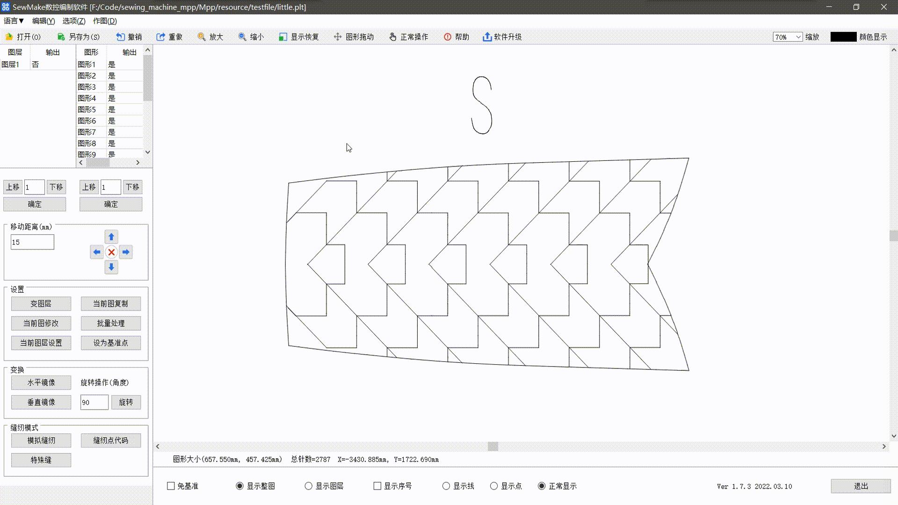

## 定位设置
在花型设计过程中，有时候需要把线连接到已有的线上，通过定位设置，可以让鼠标自动附着在已有的线上，不用用户自己点击线，能方便用户使用。

上图中可以看到，当选中`定位到轮廓线`时，在绘制图形的过程中，鼠标会自动定位到已有的线上。

## 撤销与重做
既然时图形编辑，难免存在做错了想要撤销或者重做，我们实现了这一功能。


## 批量处理
批量处理可以对同一图层上的所有图形进行设置，如下图所示，当前缝纫花型共有6个图层，图层1上共有19个图形，现在可以方便的使用批量处理功能对图层1上的所有19个图形进行一次性设置。
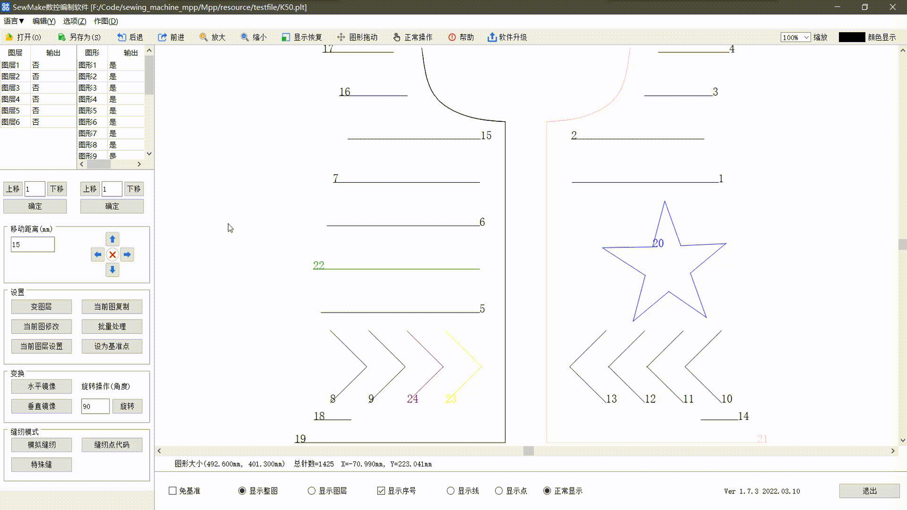
可设置的内容包括改变图形头尾长度、镜像、旋转等等。

-----

# 重点功能实现原理
针对SewMake中一些重要的功能点的原理做一些简要的阐明。

## 客户端远程升级
- 客户端分为两部分，`主程序SewMake`和`升级程序Upgrade`，主程序启动时会自动去web服务器上获取最新版本号，和本地对比，如果发现可升级就提示用户是否升级。
<center  class="half">
    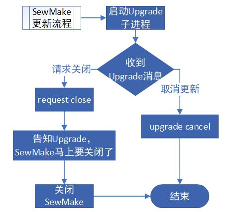
</center>

- 当用户确认升级时，启动升级程序这个子进程。升级程序会去web服务器上GET新版本主程序zip包，还会获取这个新版主程序zip包的MD5校验值。整个过程主程序处于等待`wait upgrade`状态。

- 如果MD5校验成功，那么升级程序发送`request close`消息来请求关闭主程序。主程序关闭前会通知升级程序，当主程序关闭后，升级程序解压最新版主程序zip，替换掉旧版本主程序，然后启动新的主程序完成升级。

- 期间只要任何一步出错，如MD5校验失败，或者解压失败等，都会给主程序发送upgrade cancel消息，让主程序结束等待，然后升级程序退出，主程序提示用户本次升级失败错误原因。

<center  class="half">
    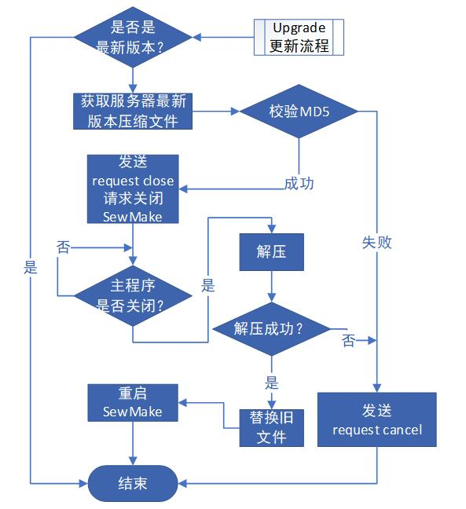
</center>

## web server
采用reactor的工作方式。一个监听线程 + 若干工作线程。
<center  class="half">
    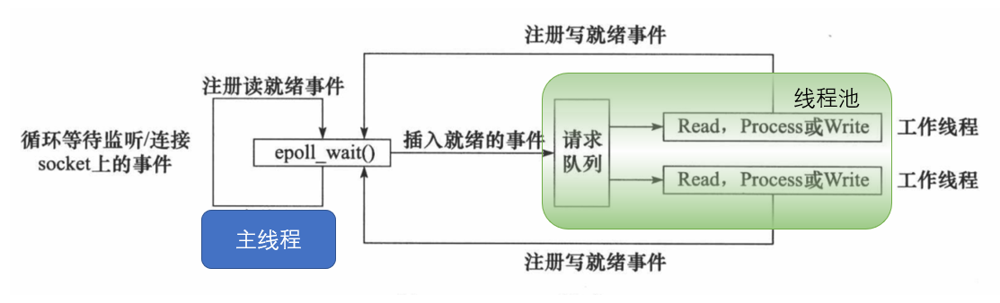
</center>

- 主线程往`epoll`内核事件表中注册`连接socket`读就绪事件。
- 主线程调用`epoll_wait`等待`socket`上有数据可读。
- 当`socket`上有数据可读时（要么是连接套接字可读，要么通信套接字可读），`epoll_wait`通知主线程。主线程则将`socket`可读事件放入线程池请求队列。
- 睡眠在请求队列上的某个工作线程被唤醒，如果是连接套接字，工作线程分配新的通信`socket`，并加入`epoll`内核事件以对其进行监听；如果是通信套接字，工作线程从`socket`读取数据，并处理客户请求（http request），然后往`epoll`内核事件表中注册该`socket`上的写就绪事件。
- 当主线程继续调用`epoll_wait`等待`socket`可写。
- 当`socket`可写时，`epoll_wait`通知主线程。主线程将`socket`可写事件放入请求队列。
- 睡眠在请求队列上的某个工作线程被唤醒，它往`socket`上写入服务器处理客户请求的结果（http response）。

## 撤销和重做
<center  class="half">
    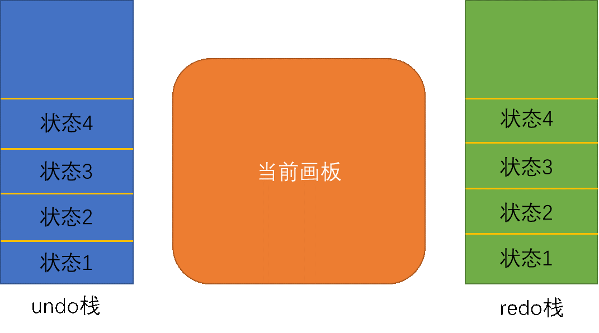
</center>

- 每次在改变当前画板内容之前，先保存当前画板状态到undo栈，以便后续能够撤销。同时清空redo栈。
- 撤销undo操作：当前画板状态压入redo栈，undo栈弹出一个状态s，把当前画板状态设置为状态s。
- 重做redo操作：当前画板状态压入undo栈，redo栈弹出一个状态s，把当前画板状态设置为状态s。

## CAD绘图状态机
<center  class="half">
    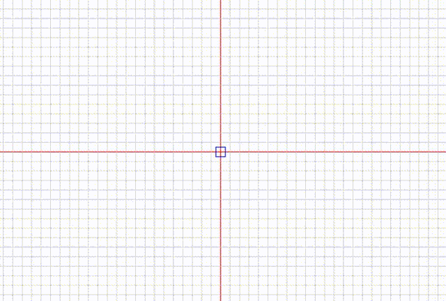
</center>

作图采用状态机原理，现以绘制矩形为例，说明该状态机的实现原理：
- 通过分析，枚举出绘制矩形的所有状态：

```C++
    //矩形绘制步骤枚举
    typedef enum {
        DRAWING_RECT_WAIT_FIRST_CLIKCKED,             //等待鼠标第一次按下
        DRAWING_RECT_MOVING,                          //鼠标移动中
        DRAWING_RECT_SECOND_CLIKCKED                  //鼠标第二次按下
    } Rectangle_Steps_t;
```

- 状态机中实时检测当前鼠标的按下状态，如下的switch一直被轮询，间隔约为20ms，一直在刷新显示。默认是等待鼠标按下状态。

```C++
switch (rectangleStatus) {

    //等待鼠标第一次点击
    case DRAWING_RECT_WAIT_FIRST_CLIKCKED: {
        if (this->isDrawingLeftBtnClicked == true) {
            this->isDrawingLeftBtnClicked = false;      //清除点击状态
            
            rectangleStatus = DRAWING_RECT_MOVING;      //切换至鼠标移动状态
            rectangleFirstPoint = ... ...               //记录第一个点
        }
        break;
    }

    //鼠标移动中
    case DRAWING_RECT_MOVING: {

        //实时绘制矩形
        painter.drawRect(QRect( this->mapFromScene(rectangleFirstPoint), this->mouseViewPos));

        //移动过程中又点击了一下
        if (this->isDrawingLeftBtnClicked == true) {
            this->isDrawingLeftBtnClicked = false;      //清除点击状态

            rectangleStatus = DRAWING_RECT_SECOND_CLIKCKED; //切换至鼠标第二次点击状态
            rectangleSecondPoint = ... ...                  //记录第二个点
        }
        break;
    }

    //切换只鼠标第二次点击
    case DRAWING_RECT_SECOND_CLIKCKED: {

        stopStateMachine();         //停止状态机, 降低cpu占用率
        dumpViewToInterface(rectangleFirstPoint, rectangleSecondPoint); //向底层接口导入矩形数据
        dumpInterfaceToScene();     //显示最新的底层接口数据

        break;
    }
```

  > `DRAWING_RECT_WAIT_FIRST_CLIKCKED`：等待鼠标第一次点击。
  > `DRAWING_RECT_MOVING`：鼠标第一次点击后，处于移动的过程中（此时还未点击`第二个点`）。此过程实时获取`鼠标位置`，实时绘制`第一个点`到当前`鼠标位置`确定的矩形。
  > `DRAWING_RECT_SECOND_CLIKCKED`：鼠标点击第二次点击后，绘制矩形需要的两个点都已确定，最后写进数据接口即可。

## 定位到轮廓线
<center  class="half">
    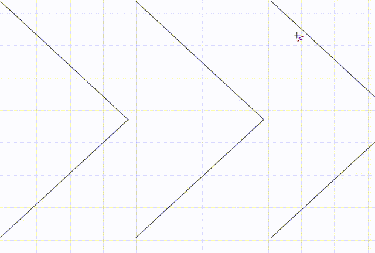
</center>

在绘制CAD图形的时候，可以让鼠标当前附着在已有的线上，实现原理如下：
 - 调用底层接口获取图形上的细分点坐标（下图中绿色的密集的点），然后利用如下公式计算一个key：
```C++
int key = (int)tmpX / 10 * 1000000 + (int)tmpY / 10; 
```
10是网格的高度和宽度，tmpX和tmpY是线上面细分点的坐标。作用让同一个格子里的点，他们的key都相同。
<center  class="half">
    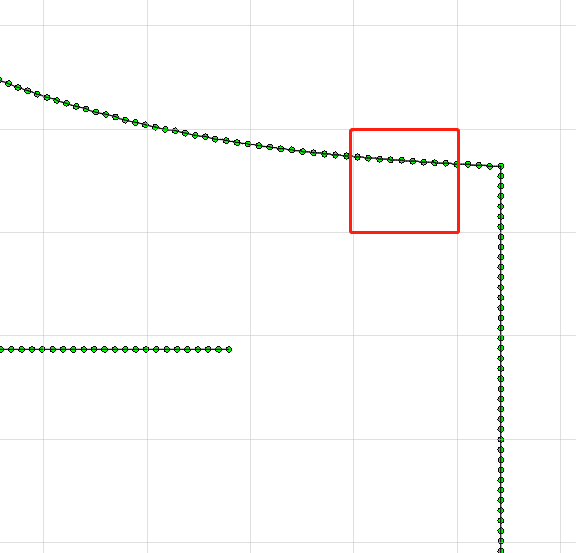
</center>

 - 用hashMap存储key相同的点，也就是同一个格子里的点都在同一个key下面。
unordered_map<int, vector<QPointF>> mapStitch;
vector<QPointF>存放的就是某个格子里的点的坐标集合。

 - 同样还是使用这个公式计算当前鼠标坐标（x, y）的key，就能得到当前鼠标的位置在哪个格子里。用这个key就能取出格子里的所有细分点坐标vector。
```C++
int key = (int)tmpX / 10 * 1000000 + (int)tmpY / 10; 
```

 - 计算鼠标坐标离vector中哪个点最近，状态机中实时绘图的时候，定位到这个点即可。
 - 这样做只需要遍历某个格子里的细分点即可，节省大量查询时间。
